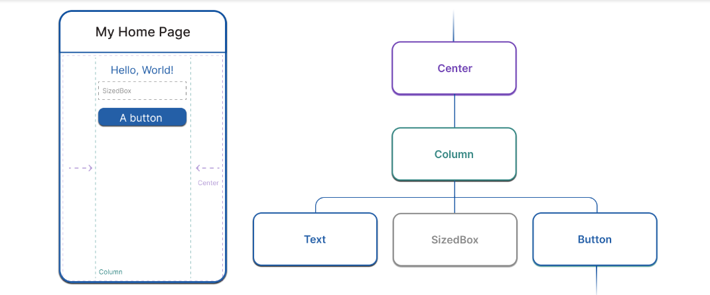

# Fundamentos do Flutter

O que são widgets?

São os blocos de construção da IU do Flutter.

## Elementos

Em relação ao Flutter, quase tudo é um widget. Como já citado acima, os widgets são os blocos de construção da IU do Flutter. Cada widget é um objeto imutável de parte do usuário.

Os widgets formam uma hierarquia com base na composição. Cada widget aninha-se dentro de seu pai e pode receber o contexto do pai. Essa estrutura carrega todo o caminho até o widget raiz.

```dart
import 'package:flutter/material.dart';
import 'package:flutter/services.dart';

void main() => runApp(const MyApp());

class MyApp extends StatelessWidget {
  const MyApp({super.key});

  @override
  Widget build(BuildContext context) {
    return MaterialApp( // Root widget
      home: Scaffold(
        appBar: AppBar(
          title: const Text('My Home Page'),
        ),
        body: Center(
          child: Builder(
            builder: (context) {
              return Column(
                children: [
                  const Text('Hello, World!'),
                  const SizedBox(height: 20),
                  ElevatedButton(
                    onPressed: () {
                      print('Click!');
                    },
                    child: const Text('A button'),
                  ),
                ],
              );
            },
          ),
        ),
      ),
    );
  }
}

```

No código anterior, todas as classes instanciadas são widgets: MaterialApp, Scaffold, AppBar, Text, Center, Builder, Column, SizedBox, e ElevatedButton.

## Composição de widgets

Como mencionado, o Flutter enfatiza os widgets como uma unidade de composição. Os widgets são tipicamente compostos de muitos outros widgets pequenos e de propósito único que se combinam para produzir efeitos poderosos.

Existem widgets de layout como Padding, Alignment, Row, Column, e Grid. Esses widgets de layout não têm uma representação visual própria. Em vez disso, seu único propósito é controlar algum aspecto do layout de outro widget. O Flutter também inclui widgets utilitários que aproveitam essa abordagem composicional. Por exemplo, Container, um widget comumente usado, é composto de vários widgets responsáveis ​​pelo layout, pintura, posicionamento e dimensionamento. Alguns widgets têm representação visual, como ElevatedButtone Textno exemplo anterior, bem como widgets como Icone Image.

Se você executar o código do exemplo anterior, o Flutter pinta um botão com o texto "Hello, World!" centralizado na tela, disposto verticalmente. Para posicionar esses elementos, há um Centerwidget, que posiciona seus filhos no centro do espaço disponível, e um Columnwidget, que dispõe seus filhos verticalmente um após o outro.




## Contruindo widgets

Para criar uma interface de usuário no Flutter, você substitui o buildmétodo em objetos widget. Todos os widgets devem ter um método build, e ele deve retornar outro widget. Por exemplo, se você quiser adicionar texto à tela com algum padding, você pode escrever assim:

```dart

class PaddedText extends StatelessWidget {
  const PaddedText({super.key});

  @override
  Widget build(BuildContext context) {
    return Padding(
      padding: const EdgeInsets.all(8.0),
      child: const Text('Hello, World!'),
    );
  }
}

```

## Estados do widget

A estrutura introduz duas classes principais de widgets: widgets com estado e sem estado.

Widgets que não têm estado mutável (eles não têm propriedades de classe que mudam ao longo do tempo) subclasse StatelessWidget. Muitos widgets internos são sem estado, como Padding, Text, e Icon. Quando você cria seus próprios widgets, você criará Statelesswidgets na maioria das vezes.

Por outro lado, se as características únicas de um widget precisam mudar com base na interação do usuário ou outros fatores, esse widget é stateful. Por exemplo, se um widget tem um contador que incrementa sempre que o usuário toca em um botão, então o valor do contador é o estado para esse widget. Quando esse valor muda, o widget precisa ser reconstruído para atualizar sua parte da IU. Esses widgets são subclasses StatefulWidget, e (porque o widget em si é imutável) eles armazenam o estado mutável em uma classe separada que é subclasse State. StatefulWidgetsnão tem um buildmétodo; em vez disso, sua interface de usuário é construída por meio de seu Stateobjeto, conforme mostrado no exemplo abaixo.


```dart
class CounterWidget extends StatefulWidget {
  @override
  State<CounterWidget> createState() => _CounterWidgetState();
}

class _CounterWidgetState extends State<CounterWidget> {
    int _counter = 0;

  void _incrementCounter() {
    setState(() {
      _counter++;
    });
  }

  @override
  Widget build(BuildContext context) {
    return Text('$_counter');
  }
}

```
