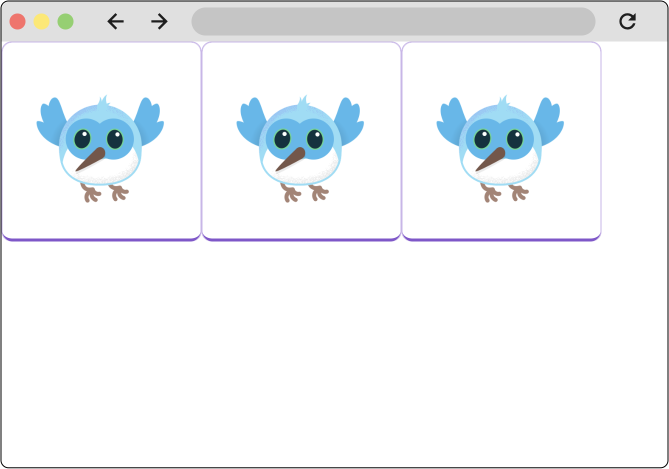
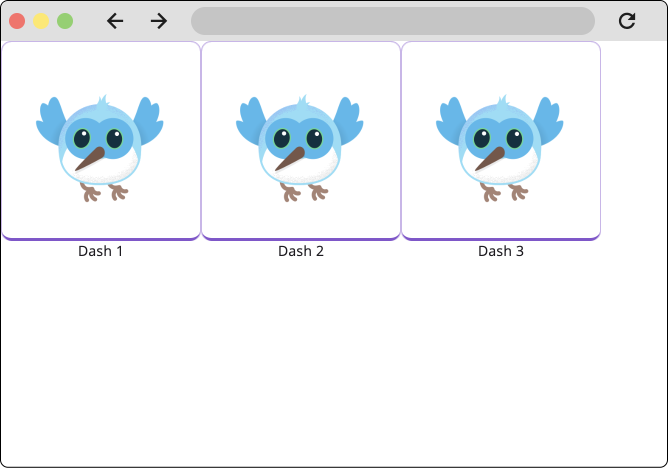
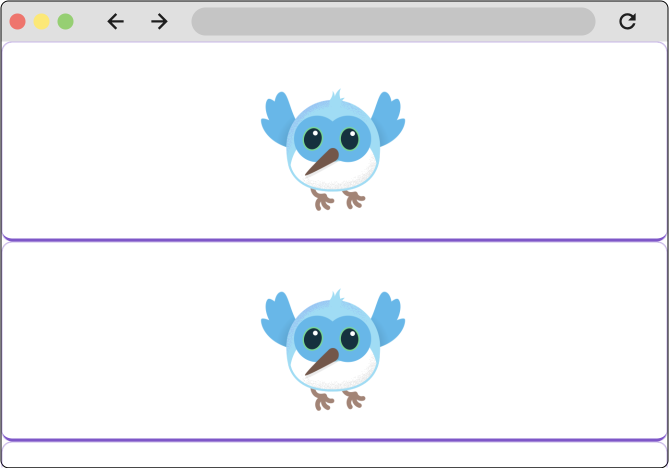

# Layouts

Considerando que o Flutter é um kit de ferramentas de IU, você gastará muito tempo criando layouts com widgets do Flutter. Nesta seção, você aprenderá como criar layouts com alguns dos widgets de layout mais comuns. Você usará o Flutter DevTools (também chamado de Dart DevTools) para entender como o Flutter está criando seu layout. Por fim, você encontrará e depurará um dos erros de layout mais comuns do Flutter, o temido erro "unbounded constraints".

## Compreendendo o layout no Flutter

O núcleo do mecanismo de layout do Flutter são os widgets. No Flutter, quase tudo é um widget — até mesmo modelos de layout são widgets. As imagens, ícones e texto que você vê em um aplicativo Flutter são todos widgets. Coisas que você não vê também são widgets, como as linhas, colunas e grades que organizam, restringem e alinham os widgets visíveis.

Você cria um layout compondo widgets para construir widgets mais complexos. Por exemplo, o diagrama abaixo mostra 3 ícones com um rótulo abaixo de cada um, e a árvore de widgets correspondente:


Neste exemplo, há uma linha de 3 colunas onde cada coluna contém um ícone e um rótulo. Todos os layouts, não importa quão complexos, são criados compondo esses widgets de layout.

## Restrições

Entender as restrições no Flutter é uma parte importante para entender como o layout funciona no Flutter.

Layout, em um sentido geral, refere-se ao tamanho dos widgets e suas posições na tela. O tamanho e a posição de qualquer widget dado são limitados por seu pai; ele não pode ter qualquer tamanho que queira, e não decide seu próprio lugar na tela. Em vez disso, o tamanho e a posição são determinados por uma conversa entre um widget e seu pai.

No exemplo mais simples, a conversa de layout se parece com isto:

1 - Um widget recebe suas restrições de seu pai.
2 - Uma restrição é apenas um conjunto de 4 duplos: uma largura mínima e máxima, e uma altura mínima e máxima.

3 - O widget determina qual deve ser seu tamanho dentro dessas restrições e passa sua largura e altura de volta para o pai.

4 - O pai olha para o tamanho que ele quer ter e como ele deve ser alinhado, e define a posição do widget de acordo. O alinhamento pode ser definido explicitamente, usando uma variedade de widgets como Center, e as propriedades de alinhamento em Rowe Column.

No Flutter, essa conversa sobre layout é frequentemente expressa com a frase simplificada: "As restrições diminuem. Os tamanhos aumentam. O pai define a posição

## Tipos de caixas

Tipos de caixa
#
No Flutter, os widgets são renderizados por seus RenderBoxobjetos subjacentes. Esses objetos determinam como lidar com as restrições que são passadas a eles.

Geralmente, existem três tipos de caixas:

- Aqueles que tentam ser o maior possível. Por exemplo, as caixas usadas por Centere ListView.
- Aqueles que tentam ser do mesmo tamanho que seus filhos. Por exemplo, as caixas usadas por TransformeOpacity
- Aqueles que tentam ser de um tamanho particular. Por exemplo, as caixas usadas por Imagee Text.

Alguns widgets, por exemplo Container, variam de tipo para tipo com base em seus argumentos de construtor. O Containerconstrutor tenta, por padrão, ser o maior possível, mas se você der a ele uma largura, por exemplo, ele tenta honrar isso e ter aquele tamanho específico.


## único widget de layout

Para criar um único widget no Flutter, envolva um widget visível, como Textou Imagecom um widget que possa mudar sua posição na tela, como um Centerwidget.

```dart

Widget build(BuildContext context) {
  return Center(
    child: BorderedImage(),
  );
}
```

Todos os widgets de layout têm um dos seguintes:

Uma childpropriedade se eles escolherem um único filho — por exemplo, Center, Container, ou Padding.
Uma childrenpropriedade se eles pegarem uma lista de widgets — por exemplo, Row, Column, ListView, ou Stack.

## Container

Containeré um widget de conveniência que é composto por vários widgets responsáveis ​​por layout, pintura, posicionamento e dimensionamento. Em relação ao layout, ele pode ser usado para adicionar preenchimento e margens a um widget. Há também um Paddingwidget que pode ser usado aqui para o mesmo efeito. O exemplo a seguir usa um Container.

```dart

Widget build(BuildContext context) {
  return Center(
    Container(
      padding: EdgeInsets.all(16.0),
      child: BorderedImage(),
    ),
  );
}

```

## Row e Column

Um dos padrões de layout mais comuns é organizar widgets verticalmente ou horizontalmente. Você pode usar um Row widget para organizar widgets horizontalmente, e um Column widget para organizar widgets verticalmente. A primeira figura nesta página usou ambos.

```dart
Widget build(BuildContext context) {
  return Row(
    children: [
      BorderedImage(),
      BorderedImage(),
      BorderedImage(),
    ],
  );
}
```


Cada filho de Rowou Columnpode ser linhas e colunas, combinando-se para criar um layout complexo. Por exemplo, você pode adicionar rótulos a cada uma das imagens no exemplo acima usando colunas.


```dart
Widget build(BuildContext context) {
  return Row(
    children: [
      Column(
        children: [
          BorderedImage(),
          Text('Dash 1'),
        ],
      ),
      Column(
        children: [
          BorderedImage(),
          Text('Dash 2'),
        ],
      ),
      Column(
        children: [
          BorderedImage(),
          Text('Dash 3'),
        ],
      ),
    ],
  );
}
```




## Alinhamento

Os widgets são consequentemente alinhados à esquerda, um após o outro, com todo o espaço extra à direita.


Você controla como uma linha ou coluna alinha seus filhos usando as propriedades mainAxisAlignmente crossAxisAlignment. Para uma linha, o eixo principal corre horizontalmente e o eixo transversal corre verticalmente. Para uma coluna, o eixo principal corre verticalmente e o eixo transversal corre horizontalmente.

Definir o alinhamento do eixo principal spaceEvenlydivide o espaço horizontal livre uniformemente entre, antes e depois de cada imagem.


```dart
Widget build(BuildContext context) {
  return Row(
    mainAxisAlignment: MainAxisAlignment.spaceEvenly,
    children: [
      BorderedImage(),
      BorderedImage(),
      BorderedImage(),
    ],
  );
}
```

As enumerações MainAxisAlignmente CrossAxisAlignmentoferecem uma variedade de constantes para controlar o alinhamento.

O Flutter inclui outros widgets que podem ser usados ​​para alinhamento, principalmente o Align widget.


## Dimensionamento dentro das rows e columns

Quando um layout é muito grande para caber em um dispositivo, um padrão listrado amarelo e preto aparece ao longo da borda afetada. Neste exemplo, a viewport tem 400 pixels de largura, e cada filho tem 150 pixels de largura.

Os widgets podem ser dimensionados para caber em uma linha ou coluna usando o Expandedwidget. Para corrigir o exemplo anterior em que a linha de imagens é muito larga para sua caixa de renderização, envolva cada imagem com um Expanded widget.

```dart
Widget build(BuildContext context) {
  return const Row(
    children: [
      Expanded(
        child: BorderedImage(width: 150, height: 150),
      ),
      Expanded(
        child: BorderedImage(width: 150, height: 150),
      ),
      Expanded(
        child: BorderedImage(width: 150, height: 150),
      ),
    ],
  );
}

```

O Expandedwidget também pode ditar quanto espaço um widget deve ocupar em relação aos seus irmãos. Por exemplo, talvez você queira que um widget ocupe o dobro do espaço que seus irmãos. Para isso, use a propriedade Expandedwidgets flex, um inteiro que determina o fator de flexão para um widget. O fator de flexão padrão é 1. O código a seguir define o fator de flexão da imagem do meio como 2:

```dart
Widget build(BuildContext context) {
  return const Row(
    children: [
      Expanded(
        child: BorderedImage(width: 150, height: 150),
      ),
      Expanded(
        flex: 2,
        child: BorderedImage(width: 150, height: 150),
      ),
      Expanded(
        child: BorderedImage(width: 150, height: 150),
      ),
    ],
  );
}
```

## widgests de rolagem


 Flutter tem muitos widgets integrados que rolam automaticamente e também oferece uma variedade de widgets que você pode personalizar para criar um comportamento de rolagem específico. Nesta página, você verá como usar o widget mais comum para tornar qualquer página rolável, bem como um widget para criar listas roláveis.


 ### ListView

 O ListView widget cria uma lista rolável de filhos. Por padrão, ListView cria uma lista vertical. Para criar uma lista horizontal, use o ListView.builder()construtor e defina o scrollDirectionpropriedade como Axis.horizontal.

 ```dart
 Widget build(BuildContext context) {
  return ListView(
	children: [
	  BorderedImage(),
	  BorderedImage(),
	  BorderedImage(),
	],
  );

  

ListViews são comumente usados ​​quando você tem um número desconhecido ou muito grande (ou infinito) de itens de lista. Quando esse for o caso, é melhor usar o ListView.builderconstrutor. O construtor builder constrói apenas os filhos que estão visíveis na tela no momento.

No exemplo a seguir, o ListViewestá exibindo uma lista de itens de tarefas. Os itens de tarefas estão sendo buscados de um repositório e, portanto, o número de tarefas é desconhecido.

```dart
final List<ToDo> items = Repository.fetchTodos();

Widget build(BuildContext context) {
  return ListView.builder(
    itemCount: items.length,
    itemBuilder: (context, idx) {
      var item = items[idx];
      return Padding(
        padding: const EdgeInsets.all(8.0),
        child: Row(
          mainAxisAlignment: MainAxisAlignment.spaceBetween,
          children: [
            Text(item.description),
            Text(item.isComplete),
          ],
        ),
      );
    },
  );
}

```


## O padrão construtor

Esses diferentes "construtores" são úteis para resolver problemas diferentes. Por exemplo, o ListView.builderconstrutor é usado principalmente para renderizar itens preguiçosamente em uma lista, enquanto o Builderwidget é útil para obter acesso ao BuildContextcódigo do widget em profundidade.

Apesar de seus diferentes casos de uso, esses construtores são unificados pela forma como funcionam. Os widgets do construtor e os construtores do construtor têm argumentos chamados 'builder' (ou algo semelhante, como itemBuilderno caso de ListView.builder), e o argumento do construtor sempre aceita um retorno de chamada. Esse retorno de chamada é uma função do construtor . As funções do construtor são retornos de chamada que passam dados para o widget pai, e o widget pai usa esses argumentos para construir e retornar o widget filho. As funções do construtor sempre passam pelo menos um argumento — o contexto de construção — e geralmente pelo menos um outro argumento.

Por exemplo, o LayoutBuilderwidget é usado para criar layouts responsivos com base no tamanho da viewport. O corpo do callback do construtor é passado para o BoxConstraintsque ele recebe de seu pai, junto com os widgets 'BuildContext'. Com essas restrições, você pode retornar um widget diferente com base no espaço disponível.

Enquanto isso, o itemBuilderretorno de chamada no ListView.builderconstrutor recebe o contexto de construção e um int. Esse retorno de chamada é chamado uma vez para cada item na lista, e o argumento int representa o índice do item da lista. A primeira vez que o retorno de chamada itemBuilder é chamado quando o Flutter está construindo a IU, o int passado para a função é 0, a segunda vez é 1, e assim por diante.

Isso permite que você forneça uma configuração específica com base no índice. Lembre-se do exemplo acima usando o ListView.builder construtor:

```dart
final List<ToDo> items = Repository.fetchTodos();

Widget build(BuildContext context) {
  return ListView.builder(
    itemCount: items.length,
    itemBuilder: (context, idx) {
      var item = items[idx];
      return Padding(
        padding: const EdgeInsets.all(8.0),
        child: Row(
          mainAxisAlignment: MainAxisAlignment.spaceBetween,
          children: [
            Text(item.description),
            Text(item.isComplete),
          ],
        ),
      );
    },
  );
}


final List<ToDo> items = Repository.fetchTodos();

Widget build(BuildContext context) {
  return ListView.builder(
    itemCount: items.length,
    itemBuilder: (context, idx) {
      var item = items[idx];
      return Container(
        color: idx % 2 == 0 ? Colors.lightBlue : Colors.transparent,
        padding: const EdgeInsets.all(8.0),
        child: Row(
          mainAxisAlignment: MainAxisAlignment.spaceBetween,
          children: [
            Text(item.description),
            Text(item.isComplete),
          ],
        ),
      );
    },
  );
}


```
